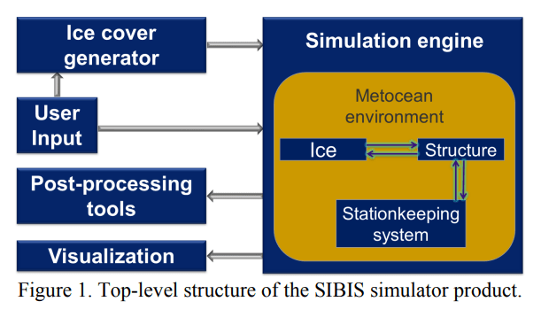
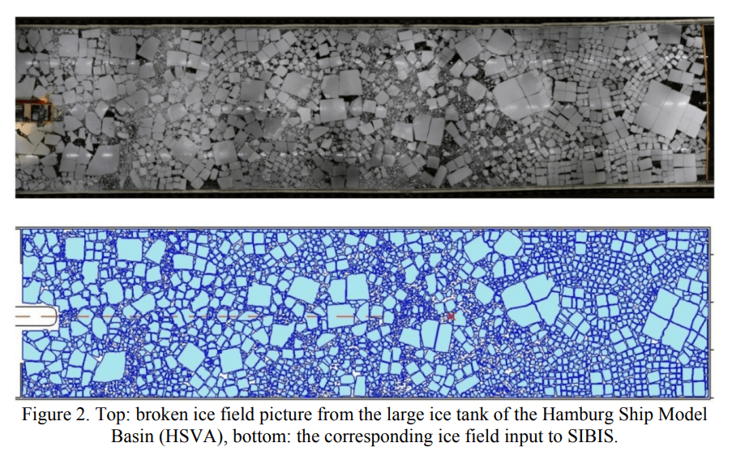
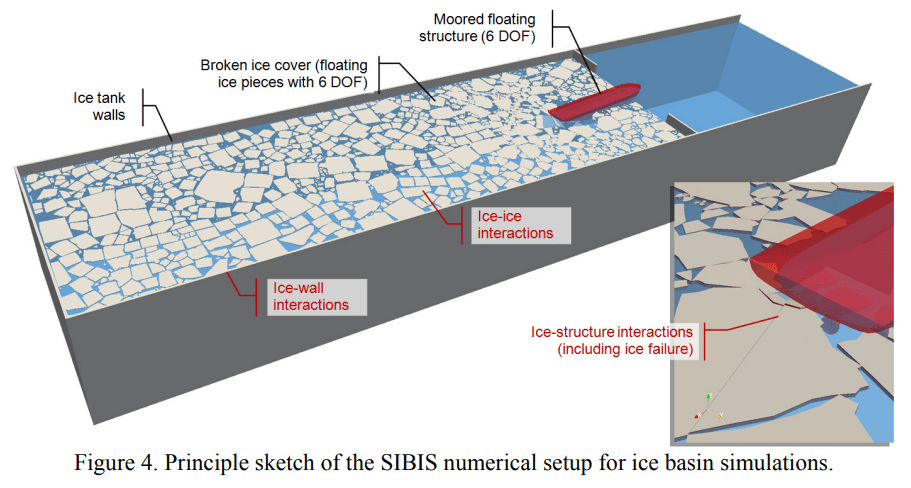
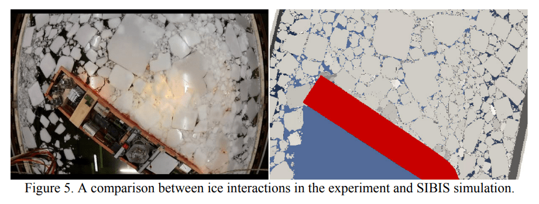
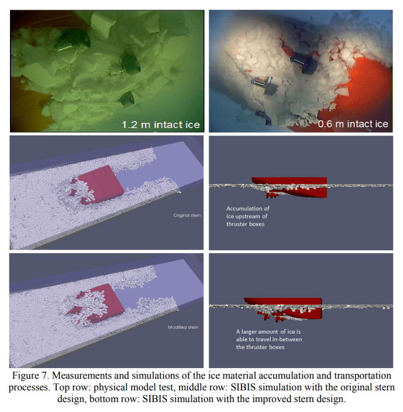
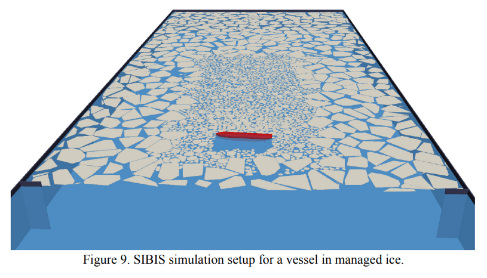
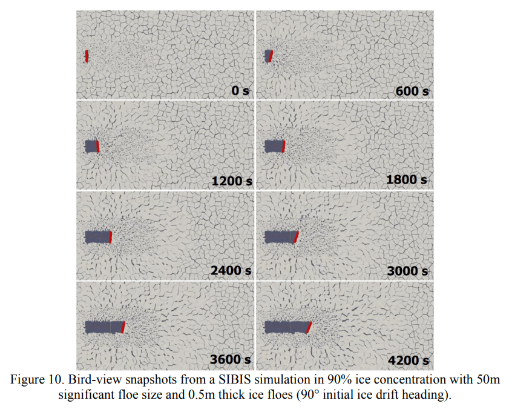
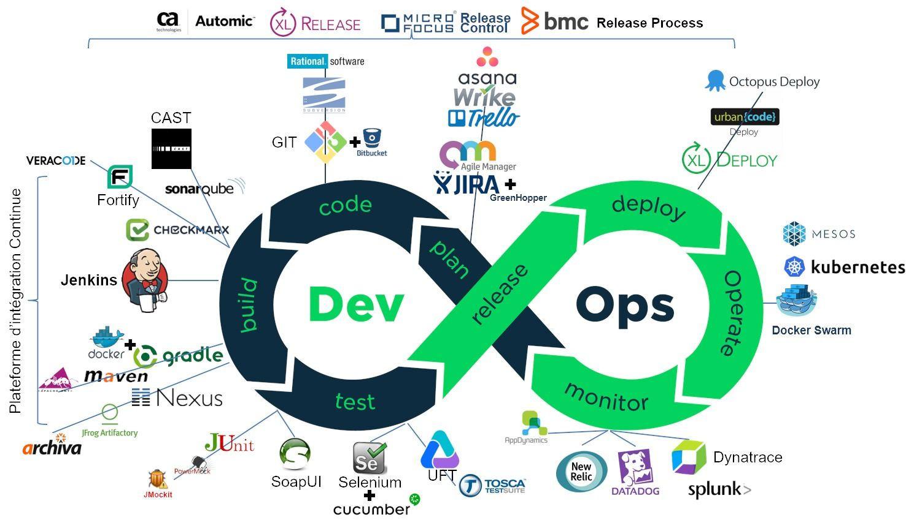

# ETUDE DE CAS POUR AMELIORER LE DEVOPS DE L'ENTREPRISE SIBIS

## INTRODUCTION

L'entreprise SIBIS ("Simulation of Interaction between Broken Ice and Structures") a conçu un simulateur d'opérations navales dans les mers de glaces afin d'éviter de mettre en jeu des ressources matérielles coûteuses pour optimiser la navigation de brise-glaces et de super-tanqueurs par d'autres entreprises qui font appel à leurs services.

___

Voici un schéma qui représente le fonctionnement actuel du système de simulation dans sa globalité :

- Au coeur du projet, le moteur de simulation calcule la position, la forme et la taille des différents blocs de glace présents dans la zone analysée (environ 180.000 lignes de code en tout).

- Ajouté à cela, il y a des outils supplémentaires (connectés à la l'application principale) utilisés par les chercheurs pour traiter les infos calculées par le moteur de simulation ; le pré-traitement gère la configuration du moteur de simulation et le post-traitement gère l'exploitation des données calculées par le moteur de simulation (notamment pour en faciliter la lecture).

___

L'application a vocation a être utilisé sur un ordinateur exclusivement et les languages utilisés actuellement sont C++ et MatLab.

___

Voici quelques captures d'écran qui mettent en évidence des exemples de rendus produits actuelement par le moteur de simulation de l'application : 

## OBJECTIF VISE

L'objectif principal visé par SIBIS est d'offrir une représentation plus esthétique des données calculées pour améliorer la visualisation des différents scenarios de navigation possibles par les bateaux sans pour autant alterer la performance des calculs.

## MES MISSIONS 

Dans le cadre de cette étude de cas fictive, j'ai été missionné pour :
1. Rédiger un rapport qui doit comparer les technologies les plus adaptées pour le moteur graphique
2. Commencer la conception du module de visualisation
3. Améliorer le workflow, des dépôts et de la qualité du code en y ajoutant une chaîne de CI/CD automatisée (dans un second temps)

## METHODOLOGIE AGILE

Mettre en place des méthodes de travail orientées "Agile" pour augmenter la performance d'une équipe ; voici les 12 principes fondateurs de cette méthodologie qu'il serait intérressant d'intégrer dans les processus de l'entreprise SIBIS :
- Livrer de la valeur au client
- Intégrer les demandes de changement
- Livrer fréquemment une version opérationnelle 
- Assurer une coopération entre le client et l’équipe
- Réaliser les projets avec des personnes motivées
- Privilégier le dialogue en face à face
- Mesurer l'avancement sur la base d'un produit opérationnel
- Faire avancer le projet à un rythme soutenable et constant
- Contrôler l’excellence technique et à la conception
- Minimiser la quantité de travail inutile
- Construire le projet avec des équipes auto-organisées
- Améliorer constamment l'efficacité de l'équipe

Voici quelques uns des avantages à utiliser l'Agilité pour l'entreprise SIBIS :
- L'adaptation constante du plan d'action
- L'intégration des modifications et évolutions au fil de l'eau
- Une communication renforcée entre les parties prenantes
- Une collaboration renforcée au sein de l'équipe projet
- Des boucles de feedback plus rapides
- Le principe de transparence avec l'ensemble des acteurs projet
- Le principe du "failing fast", qui met rapidement en avant les méthodes de travail incorrectes et inadaptées
- L'agilité crée de la prédictibilité et de la prévisibilité
- Les risques sont diminués

On peut aussi citer les avantages suivants à utiliser l'Agilité (de façon plus générale) :
- L'auto-organisation de l'équipe
- La priorisation du travail par la valeur
- Les livraisons rapides et successives
- Des prises de décision accélérées
- L'amélioration de la qualité et de la satisfaction client
- Le focus sur l'amélioration continue
- L'agilité réduit le "time-to-market" (temps de mise sur le marché d'un produit ou service)
- On peut arrêter le projet à tout moment

## CADRE DE TRAVAIL

Favoriser une meilleure communication entre les deux bureaux qui ont la même configuration (équipe de chercheurs spécialisé dans un domaine spécifique) en mettant à disposition un open space qui consiste à réunir des bureaux dans un espace ouvert et sans cloisons.

Le problème est que la configuration actuelle des locaux loués par SIBUS ne sont pas adaptés à l'open space car toutes les salles sont déjà occupées par des colaborateurs. Puisque le batiment est loué, il n'est pas envisageable de casser des cloisons. La solution restante serait donc que l'entreprise SIBIS démenage dans d'autres locaux plus adaptés à l'aménagement d'un open space.

L'open space est un modèle économique qui comporte de nombreux avantages :
  - Environnement favorable pour la mise en place des méthodologies Agile
  - Meilleure cohésion et communication entre les équipes (pour favoriser les échanges directs plus rapide et efficaces ; par exemple, entre les équipes scientifiques techniques et les responsables de la mise en production)
  - Augmentation de la réactivité (en cas de problème technique, de pic d’activité ou lorsqu'un projet se dessine, il est aisé de rassembler une équipe soudée dans un petit périmètre)
  - Réduction de la superficie nécessaire pour accueillir le même nombre de salarié (ce qui permet de baisser les charges en matière de loyer)
  - Atténuation de la forte séparation qui existe actuellement entre les équipes scientifiques techniques et les responsables de la mise en production

Il y a néanmoins quelques inconvénients à l'open space qu'il est bien d'évoquer :
  - Impression d'être constamment surveillé (générant un stress supplémentaire)
  - Augmentation du bruit de fond (générant plus de fatigabilité mentale)

Voici quelques conseils pour la mise en place d'un open space :
  - Prévoir une salle de repos et une salle de réunion dans des pièces indépendantes (suffisament à l'écart de l'open space)
  - Instaurer des règles de vie commune (pour favoriser le respect mutuel entre les colaborateurs)

## GESTION DE PROJET

Afin d'organiser et de répartir le travail au sein d'une équipe pour un projet donné, il faudrait prendre l'habitude de référencer les taches et de se positionner dessus grâce à un outil de gestion de projet. Il y a par exemples :
1. Monday
2. Trello 

Voici les avantages de Monday :
- Interface conviviale (ce qui permet aux membres de l'équipe d'utiliser le logiciel de manière efficace) 
- Ne nécessite qu'une formation minimale pour pouvoir s'en servir de façon optimisée
- Création et personnalisation des flux de travail, tableaux et tableaux de bord (ce qui permet d'adapter le logiciel à leurs besoins uniques en matière de gestion de projet)
- Approche visuelle et intuitive, avec des tableaux, des cartes et des calendriers codés par couleur (ce qui facilite le suivi des progrès et des délais d'un seul coup d'œil)
- Collaboration au sein de l'équipe en proposant des fonctionnalités telles que l'attribution de tâches, les commentaires, les pièces jointes et les notifications (ce qui permet de rationaliser la communication et de faire en sorte que tout le monde soit sur la même longueur d'onde)
- Intègration à un large éventail d'outils et d'applications tiers, tels que Google Workspace, Microsoft Office, Slack, et plus encore, permettant aux utilisateurs de connecter leur environnement de travail de manière transparente
- Fonctions d'automatisation, telles que des déclencheurs et des automatismes (ce qui permet d'éliminer les tâches répétitives et de gagner du temps)
- Génération des rapports et suivi des indicateurs clés de performance (KPI) (ce qui permet d'obtenir des informations sur l'avancement du projet et la productivité de l'équipe)

Voici les avantages de Trello :
- Interface conviviale, intuitive et simple à utiliser
- Collaboration en temps réel pour une productivité accrue
- Intégrations avec de nombreuses autres applications populaires
- Rassemblement des tâches, de la gestion des projets, des coéquipiers en un seul endroit, même si l'équipe est répartie dans le monde entier
- Projets personnalisables avec de nouveaux aspects à mesure que l'équipe s’agrandit (qui peut même comprendre des centaines de collaborateurs)
- Disponible sur diverses plateformes, y compris les appareils mobiles

## COMMUNICATION EN INTERNE

Pour le moment, il n'y a au moins 2 problèmes qui nuisent à la communication permanente et qui empechent l'inteligence collective
- Les réunions hebdomadaires (pendant lesquelles les colaborateurs abordent tour à tour les travaux effectués durant la semaine précédente et ceux envisagés pour la semaine actuelle) ne donnent pas l'occasion à chacun individuelement de rentrer dans le détail de leur recherches respectives, ni de s'organiser en équipe pour travailler ensemble sur un même projet ou une même tâche
- Le travail est fractionné en fonction de la taille des projets (pour une personne aux connaissances pointues dans un domaine donné) ; ce qui implique que chaque membre est cloisonné dans sa spécialité (autrement dit, il s'agit d'une organisation en silo qui n'est pas compatible avec la méthodologie de travail Agile)

Pour remédier à ces problèmes, la solution serait donc :
- D'ajouter au bilan hebodomaire existant la méthode Agile du "Daily scrum" (consistant à organiser une brève réunion quotidienne - généralement le matin en arrivant - concernant uniquement les membres de l’entreprise travaillant sur le sprint) afin d'avoir un horizon à court terme du travail à réaliser, de façon plus précise et plus concrète.
- D'utiliser l'ordinateur comme un outil de communication, et pas simplement comme un outil de calculs mathématiques, en encourageant tous les chercheurs et les développeurs à utiliser un outil de versionning en local puis de partager leur travail sur des répertoires communs sur le cloud.

Je recommende donc fortement à tous les colaborateurs (y compris les develloppeurs) d'utiliser Git ainsi que GitHub dont les avantages sont les suivants :
- C'est le leader sur le marché des clouds dédiés au code informatique,
- Il permet de partager du code, des connaissances et des techniques pour prendre en compte la transversalité des projets
- Le code source des projets est hébergé dans différents langages de programmation (les autres utilisateurs de GitHub peuvent passer en revue le code et proposer des modifications ou des améliorations)
- Le retour en arrière facile en cas d'erreur
- Il est possible d'accéder à l'historique de l'ensemble des commits pour un même projet (les changements apportés à chaque itération sont sauvegardés en mémoire)

___

Il faudrait aussi en place un réseau social professionnel pour permettre aux collaborateurs de faire appel les uns aux autres en cas de problème, de faciliter des micro-interventions entre eux sur des projets précis de façon plus souple (à n'importe quel moment) et afin de partager des documents à des personnes en privé (si ce n'est pas pertinent que tout le monde soit au courant de l'avancement d'un travail en cours de réalisation). Sur le marché des applications, il y a par exemples :
1. Slack
2. Quora
3. Discord

1. Je recommande fortement d'utiliser Slack dont les principaux avantages sont :
- La connexion à de nombreuses applications telles que Google Drive, Trello et Dropbox (ce qui accélère le flux de travail et la productivité) ou encore la connexion à Jira, qui permet aux équipes d’automatiser le processus d’intégration et de déploiement continus CI/CD (ainsi, tout collaborateur peut vérifier l’état du code, visualiser les structures et les déploiements, mais aussi découvrir ce qui est mis en ligne, directement en un seul et même espace)
- La collaboration en temps réel (ce qui facilite la collaboration entre des équipes à présentes en interne comme à l'internationnal)
- La centralisation des informations de l'équipe (avec un archivage des messages et des documents ainsi que des recherches avancées pour trouver rapidement les informations recherchées)
- Des canaux de communication organisés par sujet (ce qui facilite l'interaction entre les équipes et la recherche de conversations passées)
- Un haut niveau de cryptage qui répond aux normes de sécurité les plus rigoureuses (ce qui garantie la protection des informations de l'entreprise)

2. Les principaux avantages de Quora sont :
- L'échange d'informations qui dépassent la simple recherche pour intégrer l'expertise humaine et les expériences personnelles, enrichissant ainsi la compréhension sur une multitude de sujets spécifiques (forum par question/réponse)
- La possibilité de trouver des informations spécifiques et des opinions variées sur des sujets de niche
- Le système de votes positifs et des commentaires qui renforcent la réputation et crédibilité des réponses données par les experts qui comprennent vraiment les sujets abordés (le site met automatiquement en avant les réponses les plus utiles pour les utilisateurs de Quora)
- Son utilisation comme un execellent outil de brainstorming (pour favoriser l'intelligence collective entre les colaborateurs)

3. Les principaux avantages de Discord sont :
- Son interface intuitive et conviviale (qui permet aux utilisateurs de naviguer et de communiquer facilement au sein de la plateforme)
- sa polyvalence (qui peut être utilisé par des groupes d'étude et des collaborations professionnelles)
- Ses canaux textuels et vocaux (communication par le biais de messages textuels ou d'appels vocaux, ce qui permet de tenir compte des différentes préférences en matière de communication)
- Son haut degré de personnalisation par les propriétaires de serveur (ce qui leur permet de créer et de concevoir des canaux, des rôles et des autorisations adaptés aux besoins de leur communauté)
- L'intégration possible à plusieurs autres plateformes et services, notamment Twitch, YouTube, Spotify, etc. (il est ainsi facile de partager et d'apprécier le contenu dans l'environnement Discord)
- Sa gratuité d'utilisation avec de nombreuses fonctionnalités accessibles sans abonnement (il s'agit donc d'une option intéressante pour les communautés dont le budget est limité)
- Ses fonctions de sécurité telles que l'authentification à deux facteurs, le cryptage des messages et la possibilité de définir des paramètres de confidentialité pour les serveurs

## RECRUTEMENT DE PERSONNEL

Puisque l’entreprise a le budget pour recruter et qu'elle est actuellement en pleine croissance interne, la solution la plus rationnelle serait d'embaucher des développeurs salariés (avec une vraie expertise) à la place de stagiaires (qui manquent souvent d'expérience qui sont remplacés régulièrement par d'autres stagiaire).

Cette option permettrait d'augmenter significativement la qualité du code produit, la stabilité du moteur de simulation dans la durée ainsi que la notoriété de l'entreprise.

## ALLEGEMENT DE LA CHARGE DE TRAITEMENT

Sur le long terme, on peut envisager une découpe du moteur de simulation monolythique en microservices indépendants grâce à un système de type "Gateway" (afin de décharger le moteur de certaines responsabilités qui sont suffisament différentes les unes des autres pour être séparées).

Or, cette évolution demanderait un travail très conséquent pour l'équipe de dévelloppeurs (qui, pour rappel, n'est composée pour le moment que de stagiaires dont le contrat est temporaire par définition). De plus, il ne s'agit pas là du besoin exprimé par l'entreprise SIBIS dans l'attribution de mes responsabilités.

## INTEGRATION CONTINUE / DEPLOIEMENT CONTINUE

A l'heure actuelle, le processus de production est archaïque (compilation et un déploiement manuels) ; il n'y a donc pas de chaine d'outils automatisés. De nombreuses taches récurentes doivent être opérées par l'équipe de développement à chaque nouvelle mise en production de l'application, engendrant une perte de temps considérable et un risque d'erreur non négligeable (puisque les tests non-plus ne sont pas automatisés).

Pour répondre à cette problématique, je suggère d'opter pour de l'intégration continue (partie "Dev" sur le schéma) ainsi que pour du déploiement continue (partie "Ops" sur le schéma) afin d'automatiser toutes les tâches récurrentes dans le develloppement et le déploiement de l'application. Voici un schéma qui résume ces 2 concepts combinés (avec les différents outils disponibles sur le marché pour chacune des étapes du DevOps) :

Les intérêts de faire du DevOps dans le contexte d'une entreprise sont multiples :
- Le développement est plus rapide (notamment grâce aux indications de débogage automatisés qui permettent de fixer les bugs plus rapidement)
- Le débogage est plus facile (car le nombre de ligne à vérifier étant plus réduite grâce à la mise en commun régulière - à chaque "push" - et versionnée d'un projet, on peut localiser plus précisement un bug dans le code source de l'équipe)
- Les coûts sont réduits car le nombre d’erreurs à chaque étape de developpement le sont également (comme les bugs sont isolés, identifiés et corrigés rapidement, les développeurs gagnent du temps, qui peut donc être consacré au développement du produit)
- C'est plus simple d'apréhender des petits changements successifs plutôt que des gros changements ponctuels (cela diminue les risques de conflit lors de la fusion du code produit par un developpeur avec le code source commun et cela facilite aussi la maintenance & les mises à jour)

### ETAPES DE L'INTEGRATION CONTINUE ET DU DEPLOIEMENT CONTINUE

Voici une liste de tâches effectuées soit manuellement (par le develloppeur), soit automatiquement (par la chaine d'outils) où chacune d'entre elles est conditionnée à la validation et à l'achèvement de la tâche précédente :

1. Après avoir avancé sur sa branche de fonctionnalié, le developpeur fait un commit* pour sauvegarder son code en local (début de l'intégration continue locale)

* L'outil de pré-commit hook peut être configuré pour conditionner le commit à :
- L'absence d'erreurs statiques grâce à un linter (pour éviter les disparités des pratiques de travail et des conventions de codage au sein de l'équipe de developpeurs)
- L'absence d'erreurs dynamiques grâce à la validation des tests unitaires (pour s'assurer que les algorithmes donnent bien des résultats cohérents avec divers paramètres en entrée)

2. Le développeur pousse sa branche de fonctionnalité sur un répertoire distant (début de la l'intégration continue distante)

Via un fichier de type yalm dans la rubrique "GitHub Action", un deuxième contrôle peut être effectué (au cas où un develloppeur ait desinstallé le pré-commit sur sa machine) avec :
- L'absence d'erreurs statiques grâce à un linter
- L'absence d'erreurs dynamiques grâce à la validation des tests unitaires

3. Dockerisation de l'application (construction de l'image, hébergement de l'image, mise en production de l'image transformée en conteneur)

4. Code Review / Pull Request (pour s'assurer en équipe de la qualité du code produit et éventuellement repartir à l'étape de dévelloppement si besoin)

5. Déploiement / Mise en production, uniquement lorsqu'il y a une fusion avec la branche principale (début du déploiement continu)

## VEILLE SUR LES MOTEURS GRAPHIQUES 3D

Un moteur 3D est un composant logiciel qui crée des images matricielles à partir de coordonnées tridimensionnelles.

Il faut prévoir d'en acheter un pour le futur module de visualisation afin de :
- Rendre les textures des blocs de glace plus réalistes (avec l'ajout de luminosité et des ombres)
- Faciliter le codage (à l'aide de librairies comprenant des assets prêts à l'emploi)
- Augmenter la rapidité d'affichage

Un moteur graphique fournit notamment des fonctions permettant de charger des fichiers dans différents formats, d'animer les modèles en fournissant uniquement le nom de l'animation et ainsi de suite, son but étant de simplifier au maximum le travail du concepteur du module de visualisation.

Voici un comparatifs des moteurs graphiques que j'ai trouvés :
1. Panda 3D
2. Unity (Simulation) Pro
3. Unity
4. Unreal Engine 5

1. Voici les avantages de Panda 3D que je recommande d'utiliser pour les raisons suivantes :
- Sa documentation est complète
- Sa communauté est très active
- C'est un moteur open source et totalement gratuit (sans redevances, sans paiement de licence, ni enregistrement ni frais de quelque nature que ce soit, même pour un usage commercial) pour les jeux 3D en temps réel, les visualisations, les simulations, les expériences
- Il est riche en fonctionnalités qui s’adapte facilement aux besoins spécifiques en matière de flux de travail et de développement
- Il est doté d'une très grande flexibilité (gestion flexible des actifs, création de techniques graphiques et pipelines de rendu personnalisés, etc.) et performance (avec un système de profilage sur le réseau pour comprendre quelles parties sont concernées pour chaque milliseconde du temps d'image)
- Il est multiplateforme (tolérance du matériel ancien et nouveau, déploiement de l'application sur toutes les platesformes prises en charge)
- Son noyau écrit en C++ portable (pour sa vitesse d'execution) et en Python (pour sa facilité d'utilisation)
- Il n'y a aucun passe-partout ni aucun code d'initialisation compliqué
- Il est livré avec le moteur physique Bullet (bibliothèque intégrable à un programme qui permet la résolution des équations physiques)

2. Voici les avantages de Unity (Simulation) Pro :
- Le coût de l'abonnement est raisonnable : 115€/mois
- Il est possible d'exécuter plusieurs scénarios avec une physique précise à n'importe quelle échelle, sur site ou dans un cloud privé
- Il n'y a pas de dépendances vis-à-vis des systèmes qui ne bénéficient pas de la simulation (ce qui permet d'accélèrer le flux de travail à chaque étape du cycle de développement)

3. Voici les avantages de Unity :
- C'est le moteur de jeu le plus connu et le plus utilisé par les développeurs
- Il est adapté pour des modules de réalité augmentée et les contenus de réalité virtuelle (avec des visuels de qualité proffessionnelle)
- Il permet le développement de projets complexes
- Sa plateforme de développement est utilisable en version gratuite (sans limite de temps)
- Son magasin d’actifs est bien rempli
- Sa documentation est complète
- Sa communauté est très active
- Son interface est accessible à tous
- Il offre la possibilité de passer par l’IDE intégré de Unity pour générer du code manuelement avec un script rapide et simple
- Il offre une grande variété d’outils ainsi que de nombreuses ressources 2D et 3D
- Il est multiplateforme (fonctionne avec sur Steam, macOS, iOS, Android, PC)

4. Voici les avantages de Unreal Engine 5 :
- Plateforme de développement utilisable en version gratuite (sans limite de temps)
- Son magasin d’actifs est bien rempli
- Sa communauté est très active
- Sa  documentation est complète
- Il est idéal pour la création de contenus de réalité virtuelle
- Il intègre de nombreux outils qui proposent de superbes contenus et des expériences en temps réel
- Le suréchantillonnage est de haute qualité indépendamment de la plateforme (rendu dans une résolution beaucoup plus faible, mais avec des images de sortie dont la fidélité est équivalente à celle des images générées dans une résolution plus élevée)
- Son éclairage global est dynamique et il gère aussi les reflets
- L'environnement créé est entièrement dynamique avec une grande fidélité visuelle (et massivement détaillé)
- Les mondes sont ouverts, grands et immersifs

## CONCLUSION

Dans le cadre de cette étude de cas, j'ai mis par écrit plusieurs suggestions de plans d'actions et j'ai aussi fait de la veille sur des technologies qui ont fait leurs preuve sur le marché. Mais je ne veux imposer aucun choix en particulier ni aucune préférence personnelle et je laisse à l'entreprise SIBIS toute la liberté d'opter pour les solutions qui sembleront les mieux correspondre à leur besoins spécifiques en lien avec la mise en place d'une stratégie DevOps.

## BIBLIOGRAPHIE

https://blog-gestion-de-projet.com/manifeste-agile-valeurs-et-principes/#t-1621593889298

https://www.reussirsesprojets.com/avantages-methodes-agiles/

https://solutions.lesechos.fr/bureau-coworking/c/les-avantages-et-inconvenients-de-lopen-space-7695/

https://barrazacarlos.com/fr/avantages-et-inconvenients-du-logiciel-com-du-lundi/

https://meilleurs-logiciels.com/trello-fonctionnalites-prix-avis-avantages-et-inconvenients/

https://datascientest.com/github-tout-savoir

https://tecnobits.com/fr/cuales-son-las-principales-ventajas-de-slack/

https://slack.com/intl/fr-fr/resources/why-use-slack/the-value-of-slack-for-software-developers

https://www.sales-hacking.com/outils/quora

https://barrazacarlos.com/fr/avantages-et-inconvenients-de-la-discorde/

https://www.codeur.com/blog/avantages-methode-dintegration-continue/

https://www.panda3d.org/

https://www.panda3d.org/features/

https://unity.com/fr/products/unity-simulation-pro

https://foxform3d.com/18-bonnes-raisons-dutiliser-unity/

https://www.unrealengine.com/fr/unreal-engine-5
