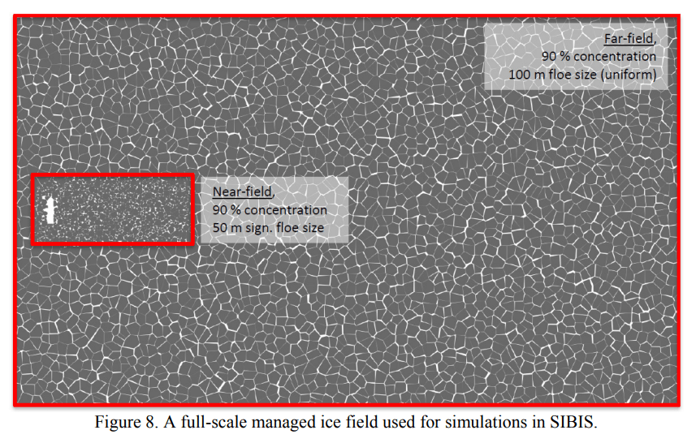

# REDACTION DE L'ETUDE DE CAS

## INTRODUCTION

L'entreprise SIBIS ("Simulation of Interaction between Broken Ice and Structures") a conçu un simulateur d'opérations navales dans les mers de glaces afin d'éviter de mettre en jeu des ressources matérielles coûteuses pour optimiser la navigation de brise-glace et de super-tanqueurs par d'autres entreprises qui font appel à leurs services.

Voici un schéma qui représente le fonctionnement actuel du système de simulation dans sa globalité :

- Au coeur du projet, le moteur de simulation calcule la position, la forme et la taille des différents blocs de glace présents dans la zone analysée (environ 180.000 lignes de code en tout).

- Ajouté à cela, il y a des outils supplémentaires (connectés à la l'application principale) utilisés par les chercheurs pour traiter les infos calculées par le moteur de simulation ; le pré-traitement gère la configuration du moteur de simulation et le post-traitement gère l'exploitation des données calculées par le moteur de simulation (notamment pour en faciliter la lecture).

L'application a vocation a être utilisé sur un ordinateur et les languages utilisés actuellement sont C++ et MatLab.

Voici quelques captures d'écran qui mettent en évidence des exemples de rendus produits actuelement par le moteur de simulation de l'application : 

## OBJECTIF VISE

L'objectif visé par SIBIS est d'offrir une représentation plus esthétique des données calculées pour améliorer la visualisation des différents scenarios de navigation possible par les bateaux sans pour autant alterer la performance des calculs.

## MES MISSIONS 

Dans le cadre d'une étude de cas fictive, j'ai été missionné pour :
1. rédiger un rapport pour comparer les technologies les plus adaptées pour le moteur graphique.
2. commencer la conception du module de visualisation.
3. améliorer le workflow, des dépôts et de la qualité du code en y ajoutant une chaîne de CI/CD automatisée (dans un second temps)

### VEILLE SUR LES MOTEURS GRAPHIQUES 3D

Un moteur 3D est un composant logiciel qui crée des images matricielles à partir de coordonnées tridimensionnelles.

Il faut prévoir d'en acheter un pour le futur module de visualisation afin de :
- rendre les textures des blocs de glace plus réaliste (avec l'ajout de luminosité et des ombres)
- facilitation du codage (à l'aide de libraries)
- performance de la rapidité d'affichage

Le moteur fournit notamment des fonctions permettant de charger des fichiers dans différents formats, d'animer les modèles en fournissant uniquement le nom de l'animation et ainsi de suite, son but étant de simplifier au maximum le travail du concepteur du module de visualisation.

Voici un comparatifs des moteurs graphiques leaders sur le marché que j'ai trouvés :

- Unreal Engine 5

- Panda 3D

- Unity graphic ?

- SDK ?

**(+ mettre les sources !)**

### RESTRUCTURATION DE L'EQUIPE EN MODE AGILE

- Mettre en place un cadre de travail orienté "Agile" pour augmenter la performance d'une équipe ; Voici ses 12 principes fondateurs à intégrer dans les processus de l'entreprise SIBIS :
  - Livrer de la valeur au client
  - Intégrer les demandes de changement
  - Livrer fréquemment une version opérationnelle 
  - Assurer une coopération entre le client et l’équipe
  - Réaliser les projets avec des personnes motivées
  - Privilégier le dialogue en face à face
  - Mesurer l'avancement sur la base d'un produit opérationnel
  - Faire avancer le projet à un rythme soutenable et constant
  - Contrôler l’excellence technique et à la conception
  - Minimiser la quantité de travail inutile
  - Construire le projet avec des équipes auto-organisées
  - Améliorer constamment l'efficacité de l'équipe

Voici quelques uns des avantages à utiliser l'Agilité en entreprise :
- L'adaptation constante du plan d'action
- L'intégration des modifications et évolutions au fil de l'eau
- Une communication renforcée entre les parties prenantes
- Une collaboration renforcée au sein de l'équipe projet
- L'auto-organisation de l'équipe
- La priorisation du travail par la valeur
- Les livraisons rapides et successives
- Des boucles de feedback plus rapides
- Des prises de décision accélérées
- L'amélioration de la qualité et de la satisfaction client
- Le focus sur l'amélioration continue
- Le principe de transparence avec l'ensemble des acteurs projet
- L'agilité réduit le time-to-market
- Le principe du "failing fast", qui met rapidement en avant les méthodes de travail incorrectes et inadaptées
- L'agilité crée de la prédictibilité et de la prévisibilité
- Les risques sont diminués
- On peut arrêter le projet à tout moment

- Favoriser une meilleure communication entre les deux bureaux qui ont la même configuration (équipe de chercheurs spécialisé dans un domaine spécifique) en mettant à disposition un open space qui consiste à réunir des bureaux dans un espace ouvert et sans cloisons.

Le problème est que la configuration actuelle des locaux loués par SIBUS ne sont pas adaptés à l'open space car toutes les salles sont déjà occupées par des colaborateurs. Puisque le batiment est loué, il n'est pas envisageable de casser des cloisons. La solution restante est que l'entreprise SIBIS démenage dans d'autres locaux plus adaptés à l'open space.

L'open space est un modèle économique qui comporte de nombreux avantages :
  - environnement favorable pour la mise en place des méthodologies Agile
  - meilleure cohésion et communication entre les équipes (pour favoriser les échanges directs plus rapide et efficaces ; par exemple, entre les équipes scientifiques techniques et les responsables de la mise en production)
  - augmentation de la réactivité (en cas de problème technique, de pic d’activité ou lorsqu'un projet se dessine, il est aisé de rassembler une équipe soudée dans un petit périmètre)
  - réduction de la superficie nécessaire pour accueillir le même nombre de salarié (ce qui permet de baisser les charges en matière de loyer)

Il y a néanmoins quelques inconvénients à l'open space qu'il est bien d'évoquer :
  - impression d'être constamment surveillé (générant un stress supplémentaire)
  - augmentation du bruit de fond (générant plus de fatigabilité mentale)

Voici quelques conseils pour la mise en place d'un open space :
  - prévoir une salle de repos et une salle de réunion dans des pièces indépendantes (suffisament à l'écart de l'open space)
  - instaurer des règles de vie commune (pour favoriser le respect mutuel entre les colaborateurs)

- "forte séparation entre les équipes scientifiques techniques et les responsables de la mise en production"

- Pour le moment, il n'y a au moins 2 problèmes qui nuisent à la communication permanente et qui empechent l'inteligence collective
  - les réunions hebdomadaires pendant lesquelles les colaborateurs abordent tour à tour les travaux effectués durant la semaine précédente et ceux envisagés pour la semaine actuelle ne donnent pas l'occasion à chacun individuelement de rentrer dans le détail de leur recherches respectives, ni ne s'organiser en équipe pour travailler ensemble sur un même projet
  - Le travail est fractionné en fonction de la taille des projets (pour une personne aux connaissances pointues dans un domaine donné) ; ce qui implique que chaque membre est cloisonné dans sa spécialité (autrement dit, il s'agit d'une organisation en silo qui n'est pas compatible avec la méthodologie de travail Agile)

Pour remédier à ces problèmes, la solution serait donc :
- d'ajouter au bilan hebodomaire existant la méthode Agile du "Daily scrum" (consistant à organiser une brève réunion quotidienne concernant uniquement les membres de l’entreprise travaillant sur le sprint) afin d'avoir un horizon à court terme du travail à réaliser, de façon précise et concrète.
- Utiliser l'ordi comme un outil de communication et pas simplement comme un outil de calculs mathématiques en encourageant tous les chercheurs et les développeurs à partager leur travail sur git et gitHub en leur expliquant tout l'intéret qu'il y a à le faire :
  - retour en arrière facile
  - versionning de son projet avec l'historique des commits
  - sauvegarde permanente sur un répertoire distant
  - échange de connaissances et de techniques permanent pour prendre en compte la transversalité des projets

- Embaucher des développeurs salariés (avec une vraie expertise) à la place de stagiaires (qui manquent souvent d'expérience) pour augmenter significativement la qualité du code produit ainsi que la notoriété de l'entreprise.

___

## REPONSES AUX QUESTIONS POUR LA PROPOSITION DE SOLUTION (il est possible de rajouter d'autres questions)

Sur le long terme, on peut envisager une découpe du simulateur monolythique en microservices indépendants mais cela demanderait un travail trop conséquent et qu'il ne s'agit pas du besoin exprimé par SIBIS.

Afin de décharger le moteur de simulation monolythique de certaines responsabilités, il serait préférable de créer d'autres services (ou programmes).

___

1. **Containerisation avec Docker :**

   - Comment Docker peut-il être utilisé pour containeriser chaque service ?

___

   - Comment gérer les dépendances entre services dans un environnement Dockerisé ?

___

2. **Chaîne CI/CD Automatisée :**

   - Comment mettre en place une chaîne CI/CD tenant compte de la séparation entre les équipes scientifiques et de production ?

___

   - Quelles étapes spécifiques doivent être automatisées pour garantir un processus CI/CD fiable ?

Les intérêts de faire de l'intégration continue sont multiples :
- 
- 
- 
- 
- 
- 

Pour garantir une meilleure qualité de code, il faut mettre en place un outil de testing pour vérifier, par le biais de tests unitaires, que les algorithmes donnent bien des résultats cohérents avec différents paramètres en entrée. Voici une comparaison entre plusieurs outils de testing :
- Vitest
- Jest
- etc.

Pour mettre fin aux disparités dans les pratiques de travail et les conventions de codage au sein de l'équipe de developpeur, il faut mettre en place un linter qui a pour but de détecter les erreurs statiques. Voici une comparaison entre plusieurs Linters :
- 
- 

Pour (...)
> Veille sur les Débuggeurs (pour détecter les erreurs dynamiques) ?
  -
  -

Pour (...)
> Veille sur les outils de dockerisation ?
  - Docker
  -

Pour (...)
> Utilisation de GitHub Action ?
  -
  -

Pour (...)
> Veille sur les outils de déploiement ?
  - Versel
  - etc.

___

3. **Tests Automatisés :**

   - Comment intégrer des tests automatisés à chaque étape du processus CI/CD ?

___

   - Quels types de tests sont essentiels pour assurer la stabilité des services ?
  > faire des tests unitaires

___

4. **Surveillance et Logging :**

   - Comment mettre en place une surveillance efficace des services en production ?

___

   - Quels mécanismes de logging peuvent aider à identifier rapidement les problèmes potentiels ?

___

## AXES D'AMELIORATION SUGGERES

### FONCTIONNEMENT INTERNE

### POINTS DE BLOCAGE IDENTIFIES PAR SIBIS

- "diversité internationale des équipes de recherche"
  - solution : (...)

- "Processus de Production Archaïque (compilation et un déploiement manuels)"
- "Absence de Tests Automatisés"
  - situation actuelle : de nombreuses taches récurentes doivent être opérées par l'équipe de développement à chaque nouvelle mise en production de l'application (les tests et le deploiment), engendrant une perte de temps considérable et un risque d'erreur non négligeable
  - solution : opter pour de l'intégration continue pour conditionner la **dockerisation** à la **validation des tests** (grâce) et de l'absence d'erreurs statiques ou dynamiques (grâce à un Linter et un debuggeur) ; un système devra ensuite récupérer l'image dockérisée puis la mettre en production automatiquement (sur un hébergeur de projets en ligne)  

## BIBLIOGRAPHIE

https://blog-gestion-de-projet.com/manifeste-agile-valeurs-et-principes/#t-1621593889298

https://www.reussirsesprojets.com/avantages-methodes-agiles/

https://solutions.lesechos.fr/bureau-coworking/c/les-avantages-et-inconvenients-de-lopen-space-7695/

